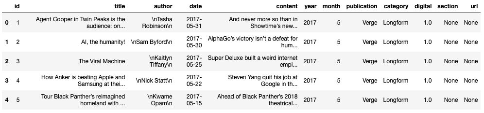
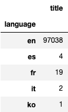
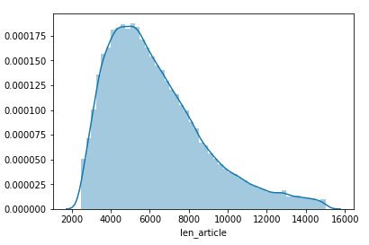
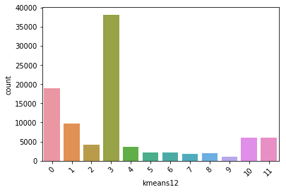
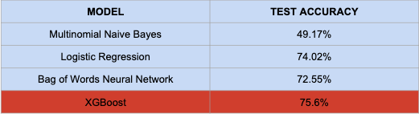
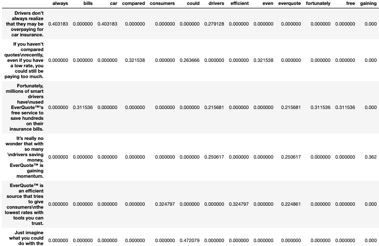
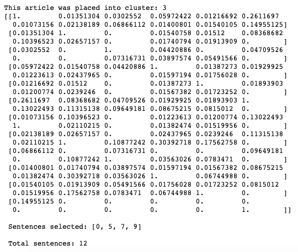
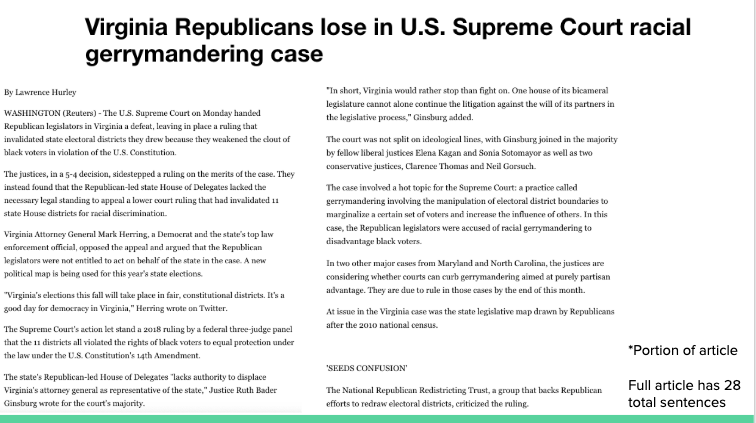
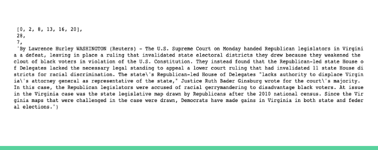

<h1>TLDR: A News Article Summarization and Classification Tool</h1>

  Link to video demonstration 

<h2>Project Goals:</h2>
<ul>
  <li>Obtain news articles to analyze text data</li>
  <li>Utilize Natrural Language Tool Kit to preprocess text</li>
  <li>Train K-Means Clustering algorithm to segment groups of news articles based on similarities in text content</li>
  <li>Train supervised classification algorithms to predict which cluster a new article would fall closest to</li>
  <li>Perform pairwise cosine similarity on an article from user input to obtain extractive text summarization to give the reader a quick view of the main points of the article</li>
</ul>

<h2>Dataset Analysis</h2>
Data was obtained from Components.com, it included over 200k news articles from 2013-2017 coming from different news outlets.  

  Preview of dataframe 
   

 
 

    A look at the languages of each article 
   

 

    Distribution of article length (in characters) 
   

After cutting out extrememly large and small articles along with non-English articles, I ended with a datset of just over 97k articles, still a pretty good size to train with.

<h2>K-Means Clustering</h2>
 
<b>Preprocessing</b> 
In order to preprocess the text data for K-Means, a number of initial steps have to be taken: 
<ul>
  <li>Tokenize words</li>
  <li>Lemmatize words</li>
  <li>Stem words</li>
  <li>Concatenate words of each record into a string and convert the entire pandas series into a list of strings</li>
  <li>Perform Count Vectorization and remove stop words</li>
  <li>Transform list of strings with TF-IDF transformation</li>
 </ul>
To speed up training stages, I cut each article down to it's first 100 words to perform clustering, this comes from the assumption that the article's main idea should most likely come up early on in the text. After fitting a number of K-Means models, I settled on using the model with 12 clusters. 
  

   

  
<h2>K-Means (12) Clustering Results</h2> 
A preview of the top words in each cluster is below:  
<ul>
  <li><b>Cluster 0:</b> state, new, year, president, people, nation, one, unit, country, govern</li>
  <li><b>Cluster 1:</b> Trump, president, Donald, would, white, house, campaign, American, Washington, administration, nation</li>
  <li><b>Cluster 2:</b> Trump, republican, party, Donald, democrat, presidential, senate, candidate, GOP, voter, nominee</li>
  <li><b>Cluster 3:</b> one, year, new, first, world, game, live, week, people, make, get, say, work, show</li>
  <li><b>Cluster 4:</b> Clinton, Hillary, Trump, democrat, campaign, Sanders, presidential, election, emails, Bernie, support</li>
  <li><b>Cluster 5:</b> Trump, Russia, investigation, intelligence, comey, election, director, Putin, Flynn</li>
  <li><b>Cluster 6:</b> school, student, university, education, year, teacher, class, week, graduate</li>
  <li><b>Cluster 7:</b> court, supreme, justice, judge, rule, federal, senate, law, appeal, Obama, legal</li>
  <li><b>Cluster 8:</b> republican, care, health, house, bill, Trump, act, senate, Obamacare, president, insurance, reform</li>
  <li><b>Cluster 9:</b> please, story, great, need, write, continue, step, block, display, extend, part, idea</li>
  <li><b>Cluster 10:</b> company, year, percent, U.S., market, billion, bank, price, rate, stock, investor, share, report, oil</li>
  <li><b>Cluster 11:</b> police, state, attack, kill, North Korea, Islam, Syria, president, military, force</li>
</ul>  

<h2>Analyzing the Clusters</h2>
Looking through the article clusters, a number of things stand out:
<ul>
  <li>Clusters 0, 1 and 2 seems to be mainly political and it looks like clusters 1 and 2 mainly lean towards articles regarding the republican election campaign. Cluster 0 seems to be quite broad politically.</li>
  <li>Cluster 3 looks extremely broad as well, and it is also the largest cluster BY FAR. This could be due to the fact that there are a large amount of articles in the dataset that have a wide range of topics. After testing my classification model, it looks like most sports articles will end up being classified as cluster 3.</li>
  <li>Cluster 4 is quite strong and it is mainly based on articles about the democratic party and Hillary Clinton</li>
  <li>Cluster 5 is specifically related to articles written about Russian meddling in the 2016 election </li>
  <li>Cluster 6 shows a strong relation to articles written about schooling</li>
  <li>Cluster 7 is highly related to the federal court system</li>
  <li>Cluster 8 looks to be primarily about political issues such as health care, tax reform etc </li>
  <li>Cluster 9 is another cluster that has a wide range of topics that don't seem to generalize to a small amount of ideas</li>
  <li>Cluster 10 is clearly made up of articles regarding financial markets</li>
  <li>Cluster 11 to me is the most impressive, this cluster seems to be built around police, military and foreign conflicts</li>
</ul>

<b>Further Clustering: 
After noticing the size and proportion of cluster #3, I had the inclination to re cluster the rows within it. As it turns out, Each cluster created from cluster #3 was soley devoted around Donald Trump and the election. Because of this, I decided not to include my reclustering into my model, instead I left cluster #3 as it is. As it turns out, the top words for cluster #3 were misleading, although I reached an answer after digging deeper. This cluster still remains broad but it seems that it is centered politically as well.  </b>

<h2>Classification Models Using K-Means Clusters</h2>

   

 

Using the clusters created by the K-Means algorithm, I trained multiple models to try to classify which cluster a new article will be put into. The overall top performer was XGBoost which gave a test accuracy of 75.6%. Somewhat surprisingly, the bag of words neural network that I trained was outperformed by logistic regression and XGBoost.

<h2>Cosine-Similarity Text Summarizer</h2>

  TF-IDF (Term Frequency - Inverse Document Frequency) gives weights to individual words based on their uniqueness compared to the document's overall vocabulary. Words with higher weights (more unique) often have more importance or provide more meaning to the document. To use this, I built a function that takes in an articles text, tokenizes each sentence (dataframe rows), creates a vocabulary without stopwords for the individual document (dataframe columns) and finally gives TF-IDF weights to each individual word in the vocab for each sentence. A preview is given below for a short text snippet. 

    

  Using the TF-IDF weights for each sentence, I convert each row into a vector and store them in a matrix. Next, I find the cosine-similarity of each TF-IDF vectorized sentence pair. An example of this is shown below for a news article:

    

Finally, after finding the cosine-similarity for all vectorized pairs, I average the weights of each vector, and return the indexes of the vectors with the highest averages. These indexes are then used to pull out the sentences from the original text for the summarization. To see the full function, head over to the new_user_functions notebook. 

  For simplicity, the amount of sentences that are returned for the summarization is equal to the square root (rounded up to the nearest integer) of the number of sentences in the article. 

<h1>Example Summary<h1>
  <h6>Article Text:</h6>

    

  <h6>Article Summary</h6>

    

  Looking at the output, I show a list of sentence indexes that were selected by the summarization tool to be extracted from the original text. The number 28 represents the number of total sentences in the original article. The number 7 represents that this article was placed into cluster #7 (court articles). And finally, the extractive summary that was outputted seems to be done quite well

<h2>Going Forward</h2>
<ul>
  <li>Adjust number of clusters to find "optimal" K-Means</li>
  <li>Add more articles from non-political topics to the dataset to adjust class imbalance</li>
  <li>Use summarizations to find cosine-similarity with other articles in the dataset</li>
  <li>Add functionality to article scraper to support more news websites</li>
</ul>
